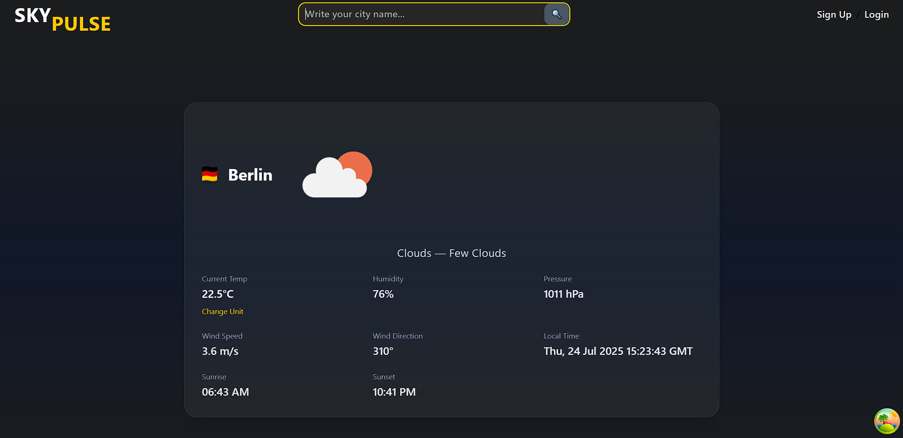

# 🌤️ Sky Pulse — Weather Forecast App



---

## Overview

Sky Pulse is a modern, **responsive weather forecast web application** built with **React 18** and **TypeScript**. It allows users to quickly search for any city worldwide and get detailed real-time weather data powered by the **OpenWeatherMap API**.

This app uses TypeScript to provide strict typing and better developer experience, ensuring that the data structures (like weather data) are well-defined and less error-prone.

---

## Features

- 🔍 **Dynamic city search** with URL routing (React Router) — user can search for any city and the app updates the URL accordingly.
- 🌡️ **Temperature unit toggle** — switch between Celsius (°C) and Fahrenheit (°F).
- 🇺🇸 **Country flags** displayed dynamically based on city data.
- 🌤️ **Detailed weather information** — including temperature, humidity, pressure, wind speed and direction, sunrise and sunset times.
- ⚡ **Optimized data fetching and caching** via **React Query** with automatic request cancellation on rapid input.
- 🔔 **Error handling and toast notifications** using `react-hot-toast`.
- 🎨 **Styled with Tailwind CSS** for a clean and responsive UI.

---

## Technologies Used

- **React 18** + **TypeScript** for building a scalable and type-safe frontend.
- **React Query** (TanStack Query) for efficient async data fetching, caching, and background updates.
- **React Router DOM** for dynamic URL routing and navigation.
- **react-hot-toast** for elegant toast notifications.
- **Tailwind CSS** for utility-first, responsive styling.
- **OpenWeatherMap API** for accurate and real-time weather data.

---

## Project Structure

```

  /api          # API request functions and TypeScript types (e.g., WeatherData type)
  /components   #  UI components (SearchBar, WeatherCard, Header, etc.)
  /utils        # Helper functions for temperature conversions, time formatting
  /ui           # Main pages (e.g., Home.tsx)
  /src
  App.tsx       # Application root with providers and routing setup
```

---

## Detailed Notes on TypeScript & Helpers

### TypeScript Usage

- The project uses TypeScript to define strict types for data, such as `WeatherData` which models the response from OpenWeatherMap API.
- This improves code safety, autocomplete support, and catches errors early during development.

### Helper Functions (`/utils/helper.ts`)

- `toCelsius(kelvin: number): number`  
  Converts Kelvin temperature (from API) to Celsius.

- `toFahrenheit(kelvin: number): number`  
  Converts Kelvin temperature to Fahrenheit.

- `formatTime(unixTime: number): string`  
  Formats a Unix timestamp (seconds) to a localized "HH:MM" time string (e.g., for sunrise/sunset).

- `getDate(dt: number, timezone: number): string`  
  Calculates and formats the local date and time based on UTC timestamp and timezone offset provided by the API.

These helpers centralize all conversion and formatting logic, keeping components clean and focused on UI.

---

## How to Run Locally

1. Clone the repo:
   ```bash
   git clone https://github.com/iRezaAkhlaghi/Sky-Pulse-Weather-Forecast-App.git   
   cd sky-pulse
   ```

2. Install dependencies:
   ```bash
   npm install
   ```

3. Start the development server:
   ```bash
   npm run dev
   ```

---


## Contact

Created by Reza Akhlaghi — feel free to connect!


